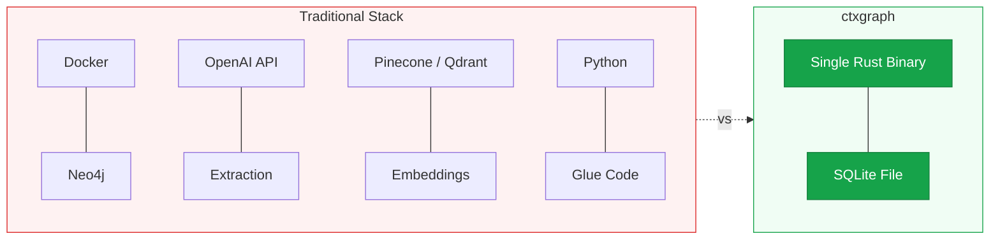
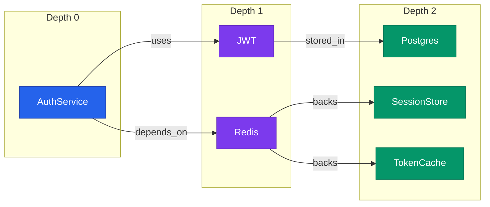
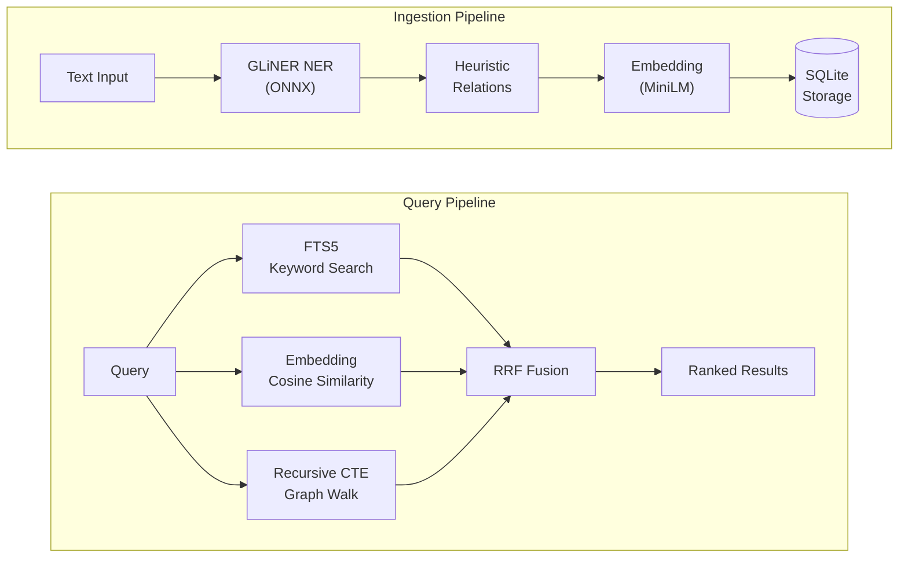

# SQLite as a Graph Database: Recursive CTEs, Semantic Search, and Why We Ditched Neo4j

Knowledge graphs are having a moment. Every AI agent framework wants one. The typical stack looks like this: Neo4j for graph storage, OpenAI for extraction, Docker to run it all. Three moving parts, two network dependencies, one `docker-compose.yml` you'll fight with for an hour.

We built [ctxgraph](https://github.com/rohansx/ctxgraph) to see how far you can get with just SQLite. The answer: surprisingly far. 0.800 combined F1 on extraction benchmarks, zero API calls, ~2 seconds for 50 episodes, single binary. No Docker. No API keys. No Neo4j.

This post walks through the actual implementation: the schema, the recursive CTEs that make SQLite behave like a graph database, and the 3-mode search fusion that ties it together.

---

## The Problem: Too Much Infrastructure for a Knowledge Graph

If you want a knowledge graph for your dev team today, the minimum viable stack is:

1. **Neo4j** -- requires Docker or a managed instance
2. **An LLM API** -- OpenAI, Anthropic, etc. for entity/relation extraction
3. **An embedding service** -- for semantic search
4. **A vector database** -- Pinecone, Qdrant, etc. for embedding storage

That's four services for what is conceptually a simple thing: "store facts about my codebase and let me query them."

We wanted something that ships as a single binary, works offline, and stores everything in a single file you can `cp` to a backup drive. SQLite was the obvious choice for storage. The question was whether it could handle graph operations.



Four services, two network dependencies, and a Docker compose file -- or one binary and one file.

## The Bet: SQLite + Recursive CTEs = Graph Database

The core insight is that a graph database is really two things: a storage format for nodes and edges, and a query engine that can walk those edges efficiently. SQLite handles the first part trivially. For the second part, recursive Common Table Expressions (CTEs) give you everything you need for multi-hop traversal.

This isn't a new idea. What we found is that with proper indexing, it's fast enough for knowledge graphs in the tens-of-thousands-of-nodes range -- which covers most single-team or single-project use cases.

## The Schema

Here's the actual schema from our migration file. Three core tables, two junction tables, three FTS5 virtual tables, and eight indexes.

```sql
-- Episodes: raw events (conversations, decisions, incidents)
CREATE TABLE episodes (
    id          TEXT PRIMARY KEY,
    content     TEXT NOT NULL,
    source      TEXT,
    recorded_at TEXT NOT NULL,
    metadata    TEXT,
    embedding   BLOB
);

-- Entities: extracted nodes (people, services, decisions)
CREATE TABLE entities (
    id          TEXT PRIMARY KEY,
    name        TEXT NOT NULL,
    entity_type TEXT NOT NULL,
    summary     TEXT,
    created_at  TEXT NOT NULL,
    metadata    TEXT,
    embedding   BLOB
);

-- Edges: relationships between entities
CREATE TABLE edges (
    id          TEXT PRIMARY KEY,
    source_id   TEXT NOT NULL REFERENCES entities(id),
    target_id   TEXT NOT NULL REFERENCES entities(id),
    relation    TEXT NOT NULL,
    fact        TEXT,
    valid_from  TEXT,
    valid_until TEXT,
    recorded_at TEXT NOT NULL,
    confidence  REAL DEFAULT 1.0,
    episode_id  TEXT REFERENCES episodes(id),
    metadata    TEXT
);
```

### Why Bi-Temporal Matters

Look at the `edges` table. It has two temporal dimensions:

- **`valid_from` / `valid_until`** -- when the fact was true *in the real world*. "AuthService depends on Redis" was valid from March 1st until March 15th, when we migrated to Postgres.
- **`recorded_at`** -- when the system *learned* about the fact. We might record the Redis-to-Postgres migration on March 20th, five days after it happened.

This distinction matters for debugging. "What did we *know* about the system on March 10th?" is a different question from "What was *actually true* about the system on March 10th?" Bi-temporal modeling lets you answer both.

In practice, querying "current state" means filtering for `valid_until IS NULL`:

```sql
SELECT * FROM edges
WHERE (source_id = ?1 OR target_id = ?1)
  AND valid_until IS NULL
ORDER BY recorded_at DESC
```

Invalidating an edge doesn't delete it -- it sets `valid_until`, preserving the full history:

```sql
UPDATE edges SET valid_until = ?1
WHERE id = ?2 AND valid_until IS NULL
```

This is the same pattern Datomic and Graphiti use. The difference is we do it in a 2MB SQLite file instead of a JVM process or a Neo4j container.

## Graph Traversal via Recursive CTE

This is the core of making SQLite act as a graph database. Here's the actual traversal query from our codebase:

```sql
WITH RECURSIVE traversal(entity_id, depth) AS (
    -- Base case: start at the given entity
    SELECT ?1, 0

    UNION

    -- Recursive step: walk edges in both directions
    SELECT
        CASE WHEN e.source_id = t.entity_id THEN e.target_id
             ELSE e.source_id END,
        t.depth + 1
    FROM traversal t
    JOIN edges e ON (e.source_id = t.entity_id OR e.target_id = t.entity_id)
    WHERE t.depth < ?2
      AND e.valid_until IS NULL  -- only current edges
)
SELECT DISTINCT ent.id, ent.name, ent.entity_type, ent.summary,
                ent.created_at, ent.metadata, t.depth
FROM traversal t
JOIN entities ent ON ent.id = t.entity_id
ORDER BY t.depth
```

Here's what the traversal looks like on a small graph. Starting from "AuthService" at depth 0, the CTE walks outward one hop at a time:



The CTE starts with "AuthService" (depth 0, blue), discovers "JWT" and "Redis" (depth 1, purple), then reaches "Postgres", "SessionStore", and "TokenCache" (depth 2, green). `UNION` deduplicates, so if two paths reach the same node, it appears only once.

Let's break down what this does:

1. **Base case**: Seed the traversal with the starting entity at depth 0.
2. **Recursive step**: For each entity already discovered, find all edges where it's either the source or the target. This gives you **bidirectional traversal** -- you walk the graph regardless of edge direction.
3. **The `CASE` expression**: Picks the *other* end of the edge. If we arrived via `source_id`, take `target_id`, and vice versa.
4. **Depth limiting**: `WHERE t.depth < ?2` caps how many hops you'll walk.
5. **Temporal filtering**: `AND e.valid_until IS NULL` restricts to currently-valid edges. Remove this clause to traverse the full history.
6. **`UNION` (not `UNION ALL`)**: Deduplicates. If entity B is reachable from A via two different paths, it appears once.

After collecting traversed entities, we grab all edges between them in a second query:

```sql
SELECT id, source_id, target_id, relation, fact,
       valid_from, valid_until, recorded_at, confidence, episode_id, metadata
FROM edges
WHERE source_id IN (?1, ?2, ...) AND target_id IN (?1, ?2, ...)
  AND valid_until IS NULL
ORDER BY recorded_at DESC
```

### How This Compares to Cypher

The equivalent Neo4j Cypher query would be:

```cypher
MATCH path = (start:Entity {id: $id})-[*1..3]-(neighbor)
WHERE ALL(r IN relationships(path) WHERE r.valid_until IS NULL)
RETURN DISTINCT neighbor, length(path) AS depth
ORDER BY depth
```

Cypher is more concise, no question. But the SQL version is self-contained -- no external database process, no Bolt protocol, no connection pooling. And for knowledge graphs under ~50k entities, the performance difference is negligible.

## 3-Mode Search Fusion

Search is where things get interesting. We have three retrieval modes, each with different strengths:

1. **FTS5 keyword search** -- exact token matching via SQLite's built-in full-text search (BM25 ranking)
2. **Semantic similarity** -- cosine similarity against embeddings from `all-MiniLM-L6-v2` (384 dimensions, runs locally via ONNX)
3. **Graph traversal** -- walk edges from entities mentioned in the query

Here's how data flows through the system, from ingestion to query:



Three independent retrieval modes run in parallel, each producing a ranked list. Reciprocal Rank Fusion combines them without needing comparable scores.

The problem: how do you combine ranked results from three systems with completely different scoring scales? BM25 scores, cosine similarities, and graph depth are not comparable.

### Reciprocal Rank Fusion (RRF)

The answer is [Reciprocal Rank Fusion](https://plg.uwaterloo.ca/~gvcormac/cormacksigir09-rrf.pdf). Instead of combining *scores*, you combine *ranks*:

```
rrf_score(d) = sum( 1 / (k + rank_i(d)) )  for each mode i where d appears
```

With k=60 (the standard constant from the original paper), a document ranked #1 in one mode gets `1/61 = 0.0164`. Ranked #10 gets `1/70 = 0.0143`. The key property: a document appearing in *multiple* modes gets scores from each, naturally boosting results that are relevant across different retrieval strategies.

Here's the actual implementation from `graph.rs`:

```rust
pub fn search_fused(
    &self,
    query: &str,
    query_embedding: &[f32],
    limit: usize,
) -> Result<Vec<FusedEpisodeResult>> {
    const K: f64 = 60.0;

    let mut scores: HashMap<String, f64> = HashMap::new();
    let mut episodes_map: HashMap<String, Episode> = HashMap::new();

    // --- FTS5 ranked list ---
    let fts_pool = (limit * 10).max(200);
    if let Ok(fts) = self.storage.search_episodes(query, fts_pool) {
        for (rank, (episode, _)) in fts.into_iter().enumerate() {
            let rrf = 1.0 / (K + rank as f64 + 1.0);
            *scores.entry(episode.id.clone()).or_insert(0.0) += rrf;
            episodes_map.insert(episode.id.clone(), episode);
        }
    }

    // --- Semantic (cosine similarity) ranked list ---
    let all_embeddings = self.get_embeddings()?;
    if !all_embeddings.is_empty() && !query_embedding.is_empty() {
        let mut semantic: Vec<(String, f32)> = all_embeddings
            .into_iter()
            .map(|(id, vec)| {
                let sim = cosine_similarity(query_embedding, &vec);
                (id, sim)
            })
            .collect();
        semantic.sort_by(|a, b| b.1.partial_cmp(&a.1).unwrap());

        for (rank, (ep_id, _sim)) in semantic.into_iter().enumerate() {
            let rrf = 1.0 / (K + rank as f64 + 1.0);
            *scores.entry(ep_id.clone()).or_insert(0.0) += rrf;
        }
    }

    // Sort by total RRF score descending, take top `limit`
    let mut fused: Vec<(String, f64)> = scores.into_iter().collect();
    fused.sort_by(|a, b| b.1.partial_cmp(&a.1).unwrap());
    // ... take(limit) and return
}
```

The FTS5 query underneath is straightforward:

```sql
SELECT e.id, e.content, e.source, e.recorded_at, e.metadata, rank
FROM episodes_fts fts
JOIN episodes e ON e.rowid = fts.rowid
WHERE episodes_fts MATCH ?1
ORDER BY rank
LIMIT ?2
```

FTS5's `rank` column is the negative BM25 score (lower is better), so we negate it. But with RRF, the raw score doesn't matter -- only the position in the ranked list.

### Why Not Just Use Vector Search?

Pure semantic search misses exact matches. If someone searches for "Redis migration," you want episodes containing the literal string "Redis migration" to rank highly even if their embedding isn't the closest vector. FTS5 catches these. Conversely, semantic search catches rephrased mentions ("moved our caching layer to a different store") that keyword search would miss.

RRF is the simplest way to get both without tuning weights.

## Performance: 8 Indexes and Why SQLite Scales

Here are the eight indexes we maintain:

```sql
CREATE INDEX idx_edges_source     ON edges(source_id);
CREATE INDEX idx_edges_target     ON edges(target_id);
CREATE INDEX idx_edges_relation   ON edges(relation);
CREATE INDEX idx_edges_valid      ON edges(valid_from, valid_until);
CREATE INDEX idx_entities_type    ON entities(entity_type);
CREATE INDEX idx_episode_entities ON episode_entities(entity_id);
CREATE INDEX idx_episodes_source  ON episodes(source);
CREATE INDEX idx_episodes_recorded ON episodes(recorded_at);
```

What each optimizes:

| Index | Optimizes |
|-------|-----------|
| `idx_edges_source` / `idx_edges_target` | Graph traversal JOIN on `edges.source_id` and `edges.target_id`. Without these, every recursive CTE step is a full table scan. |
| `idx_edges_relation` | Filtering edges by relation type ("show me all `depends_on` edges"). |
| `idx_edges_valid` | Temporal queries. The composite index on `(valid_from, valid_until)` lets the planner efficiently filter current vs. historical edges. |
| `idx_entities_type` | Listing/filtering entities by type. Used during deduplication (find all entities of type "Service" for fuzzy matching). |
| `idx_episode_entities` | Reverse lookup: "which episodes mention this entity?" |
| `idx_episodes_source` / `idx_episodes_recorded` | Filtering episodes by source system and time-range queries. |

On top of these, we have three FTS5 virtual tables (`episodes_fts`, `entities_fts`, `edges_fts`) with triggers that keep them in sync on every INSERT, UPDATE, and DELETE. FTS5 maintains its own inverted index internally.

### SQLite Scales Further Than You Think

Common objection: "SQLite can't handle large datasets." In practice:

- SQLite handles **millions of rows** without issue when properly indexed. Our edge traversal is O(branching_factor^depth), bounded by `max_depth`, not by total table size.
- **WAL mode** (`PRAGMA journal_mode = WAL`) allows concurrent reads during writes. We set this on every connection.
- **Page cache** scales with available RAM. SQLite's default 2MB cache can be bumped to 64MB+ for hot datasets.
- The semantic search scan (loading all embeddings for cosine similarity) is the bottleneck. At 10k episodes with 384-dim embeddings, that's ~15MB of data. Loads in milliseconds.

### When You'd Actually Need HNSW

The brute-force cosine similarity scan works fine up to roughly 50-100k embeddings. Beyond that, you want an approximate nearest neighbor index. Options:

- **sqlite-vec** -- SQLite extension that adds HNSW indexing. Drop-in compatible.
- **Qdrant/Milvus** -- if you need distributed vector search.

We chose brute-force initially because it's zero dependencies and the accuracy is exact (no approximation error). For a single-team knowledge graph, you're unlikely to hit 100k episodes.

## The Results

From our benchmark against 50 gold-labeled episodes (ADRs, incident reports, PR descriptions, migration plans):

| Metric | ctxgraph (local) | Graphiti + gpt-4o |
|--------|:----:|:----:|
| Entity F1 | **0.837** | 0.570 |
| Relation F1 | **0.763** | 0.104* |
| **Combined F1** | **0.800** | 0.337* |
| API calls | **0** | ~200+ |
| Cost per run | **$0** | ~$2-5 |
| Latency (50 eps) | **~2s** | ~8min |

*\* Graphiti's free-form relations mapped to ctxgraph's fixed taxonomy with generous keyword heuristics.*

The extraction pipeline uses GLiNER Large v2.1 (INT8 ONNX) for NER and a heuristic keyword + proximity scorer for relation extraction. Everything runs locally. The ~2 second total for 50 episodes works out to roughly **40ms per episode**.

Why does a local ONNX model beat gpt-4o? It's not that gpt-4o is worse at understanding text. It's that Graphiti extracts *differently*: multi-word descriptive phrases ("primary Postgres cluster") instead of canonical names ("Postgres"), free-form relation verbs instead of a fixed schema. For structured downstream querying, schema-typed extraction with a focused model wins.

## When NOT to Use This

SQLite-as-graph-database is the right call for a specific range of problems. Here's when it isn't:

**Scale: >100k entities with deep traversals.** The recursive CTE does a breadth-first search via SQL. At depth 4 with an average branching factor of 10, you're visiting 10,000 nodes per query. SQLite handles this in milliseconds with proper indexes, but at 500k entities with depth 6, you'll feel it. Neo4j's native graph storage format is genuinely faster for deep traversals on large graphs.

**Concurrency: multi-user concurrent writes.** SQLite's write lock is process-wide. WAL mode helps (concurrent reads are fine), but if you have 10 services writing to the same graph simultaneously, you'll hit contention. PostgreSQL with a graph schema, or Neo4j, are better choices.

**Query expressiveness: when you need Cypher.** Cypher's pattern matching is more expressive than recursive CTEs. "Find all paths between A and B where every intermediate node is a Service" is natural in Cypher and painful in SQL. If your queries look like this regularly, use a graph database.

**Distributed systems.** SQLite is a single-file embedded database. It doesn't replicate, shard, or cluster. If you need your knowledge graph available across multiple machines, this isn't the architecture.

## The Takeaway

SQLite is not a graph database. But with recursive CTEs, FTS5, embeddings stored as BLOBs, and Reciprocal Rank Fusion to tie it all together, it's a remarkably capable one for the single-user, single-machine use case.

The full stack -- entity extraction, relation extraction, graph storage, keyword search, semantic search, graph traversal -- runs as a single binary with no network dependencies. The database is a single file. Backup is `cp`. Deployment is `cargo install`.

Sometimes the best architecture is the one with the fewest moving parts.
